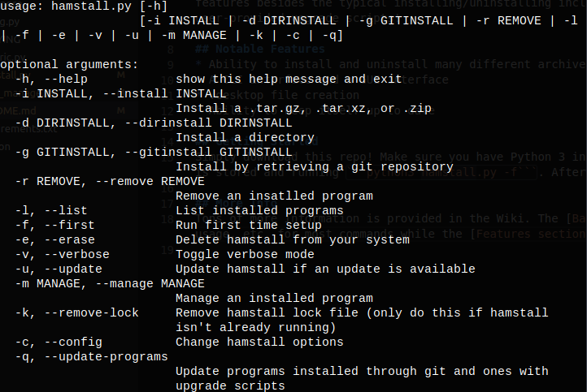
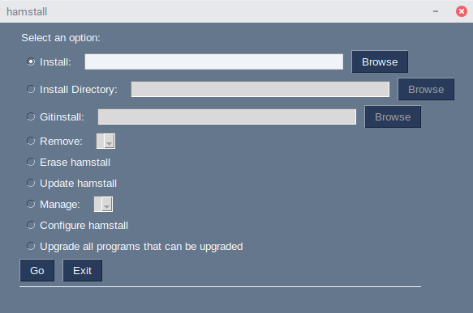

## WARNING

This repository is archived. Check out [tarstall](https://github.com/hammy3502/tarstall), for the latest version of hamstall!

# hamstall




hamstall is a lightweight package manager for Linux (and similar) systems that manages programs stored in archives, programs stored as directories, and remote git repositories! It's built off of Python 3 and currently manages .zip, .7z, .rar, .tar.gz, and .tar.xz archives, directories, and git repositories! It has an array of features besides the typical installing/uninstalling including path management, .desktop creation, alias creation (binlinks), and program updating through git and user-provided upgrade scripts!

## Notable Features
* Ability to install and uninstall many different archive types
* A CLI interface and a GUI interface
* .desktop file creation
* Ability to keep itself up to date

## Getting Started
Simply download this repo! Make sure you have Python 3 installed and you should be set! You can invoke first time setup by navigating to the directory where hamstall is stored and running ```python3 hamstall.py -f```. Afterwards, feel free to use ```hamstall -h``` to view a list of commands!

## More Info
Tons of more information is provided in the Wiki. The [Basic Usage section of the wiki](https://github.com/hammy3502/hamstall/wiki/Basic-Usage) provides examples, usage, etc. for most commands while the [Features section of the wiki](https://github.com/hammy3502/hamstall/wiki/Features) details all of the features of hamstall.
